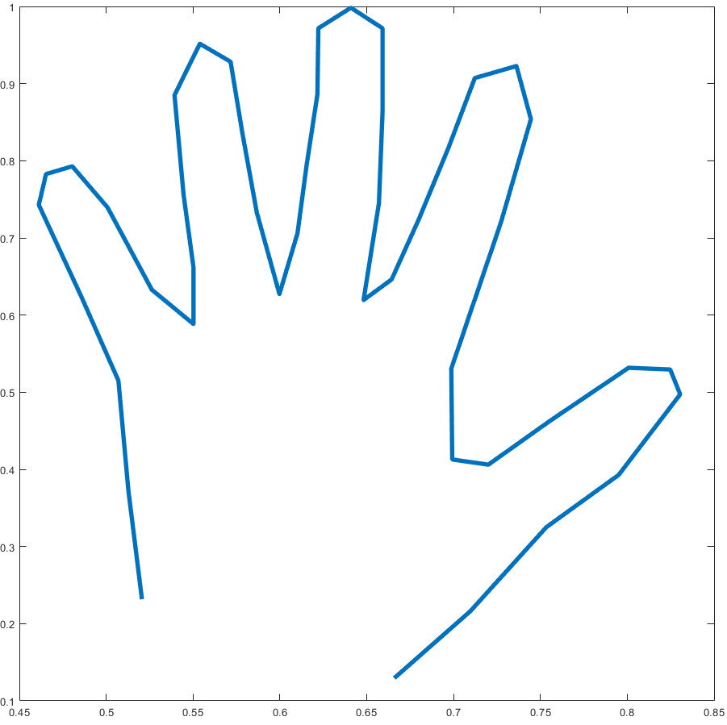
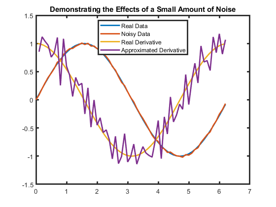

# Numerical Methods with Applications

 or 

**Curriculum Module**

_Created with R2021b. Compatible with R2021b and later releases._

# Information

This curriculum module contains interactive [MATLAB® live scripts](https://www.mathworks.com/products/matlab/live-editor.html) that teach fundamental concepts and basic terminology related to designing and implementing numerical methods related to interpolation, numerical integration and differentiation, and numerical solutions to ordinary and partial differential equations.

## Background

You can use these live scripts as demonstrations in lectures, class activities, or interactive assignments outside class. This module addresses standard topics from a first course in numerical methods including interpolation, numerical integration and derivation, and several numerical solution methods for ODEs and PDEs.

The instructions inside the live scripts will guide you through the exercises and activities. Get started with each live script by running it one section at a time. To stop running the script or a section midway (for example, when an animation is in progress), use the  Stop button in the **RUN** section of the **Live Editor** tab in the MATLAB Toolstrip.

## Contact Us

Solutions are available upon instructor request. Contact the [MathWorks teaching resources team](mailto:onlineteaching@mathworks.com) if you would like to request solutions, provide feedback, or if you have a question.

## Prerequisites

This module assumes familiarity with basic programming concepts such as floating\-point doubles and strings, structures including constants, vectors, matrices, arrays, control flows including if/else, for loops, and while loops, and how to use them in MATLAB. These ideas are all presented with interactive examples in [<u>Fundamentals of Programming</u>](https://www.mathworks.com/matlabcentral/fileexchange/103225-fundamentals-of-programming). This module assumes familiarity with polynomials, derivatives, and integrals. To use the partial differential equation scripts, a student must be familiar with the concepts of partial derivatives and multivariable functions. These scripts do not assume knowledge of analytic solutions to ordinary or partial differential equations.

## Getting Started
### Accessing the Module
### **On MATLAB Online:**

Use the  link to download the module. You will be prompted to log in or create a MathWorks account. The project will be loaded, and you will see an app with several navigation options to get you started.

### **On Desktop:**

Download or clone this repository. Open MATLAB, navigate to the folder containing these scripts and double\-click on [NumerialMethods.prj](https://matlab.mathworks.com/open/github/v1?repo=MathWorks-Teaching-Resources/Numerical-Methods-with-Applications&project=NumericalMethods.prj). It will add the appropriate files to your MATLAB path and open an app that asks you where you would like to start. 

Ensure you have all the required products (listed below) installed. If you need to include a product, add it using the Add\-On Explorer. To install an add\-on, go to the **Home** tab and select   **Add-Ons** > **Get Add-Ons**. 

## Products

MATLAB® is used throughout. Tools from the Symbolic Math Toolbox™ are used frequently as well. 

-  <samp>drawpolygon</samp> from Image Processing and Computer Vision™ is used to create datasets in <samp>Hand.mlx</samp> and <samp>MeasureLakeArea.mlx</samp> 
-  Statistics and Machine Learning Toolbox™ and the Curve Fitting Toolbox™ are used in <samp>Interpolation.mlx</samp> 
-  <samp>geoplayer</samp> from Automated Driving Toolbox™ is used in TrackStorms.mlx to create elegant visualizations, but pedagogically similar plots are demonstrated with geoplot as well. 

# Scripts
## [**Interpolation.mlx**](https://matlab.mathworks.com/open/github/v1?repo=MathWorks-Teaching-Resources/Numerical-Methods-with-Applications&project=NumericalMethods.prj&file=Interpolation.mlx) 
|     | **In this script, students will...**    -  define interpolation and explain how it is different from regression and extrapolation    -  demonstrate multiple solutions to an interpolation problem, even when interpolating by polynomials    -  implement three different interpolation functions    | **Applications**    -  Drawing a smooth rendition of their hand    -  Tracking the path of a cyclone   **Scaffolded Template Scripts**   [<samp>linInterp.m</samp>](./FunctionLibrary/linInterp.m)   [<samp>pcHInterp.m</samp>](./FunctionLibrary/pcHInterp.m)   [<samp>pcSpline.m</samp>](./FunctionLibrary/pcSpline.m)     |
| :-- | :-- | :-- |

## Supporting Scripts
-  [<samp>Hand.mlx</samp>](https://matlab.mathworks.com/open/github/v1?repo=MathWorks-Teaching-Resources/Numerical-Methods-with-Applications&project=NumericalMethods.prj&file=Hand.mlx) 
-  [<samp>TrackStorms.mlx</samp>](https://matlab.mathworks.com/open/github/v1?repo=MathWorks-Teaching-Resources/Numerical-Methods-with-Applications&project=NumericalMethods.prj&file=TrackStorms.mlx) 
## [**NumericalDerivatives.mlx**](https://matlab.mathworks.com/open/github/v1?repo=MathWorks-Teaching-Resources/Numerical-Methods-with-Applications&project=NumericalMethods.prj&file=NumericalDerivatives.mlx) 
|     | **In this script, students will...**    -  determine numerical derivative approximations formulas    -  use Taylor's theorem to calculate the order of the error for a numerical approximation to a derivative    -  demonstrate how numerical derivatives can magnify approximation errors    | **Applications**    -  Numerical solutions to differential equations     |
| :-- | :-- | :-- |

## [**NumericalIntegration.mlx**](https://matlab.mathworks.com/open/github/v1?repo=MathWorks-Teaching-Resources/Numerical-Methods-with-Applications&project=NumericalMethods.prj&file=NumericalIntegration.mlx) 
|     | **In this script, students will...**    -  implement Euler's method, Gaussian 2\-point approximations, and Simpson's rule for numerical integration    -  explain why higher\-order approximations may not be appropriate in applications    | **Applications**    -  Measure the area of a lake   **Scaffolded Template Scripts**   [<samp>eulerMethod.m</samp>](./FunctionLibrary/eulerMethod.m)   [<samp>gauss2pt.m</samp>](./FunctionLibrary/gauss2pt.m)   [<samp>simpsonsRule.m</samp>](./FunctionLibrary/simpsonsRule.m)     |
| :-- | :-- | :-- |

## Supporting Scripts
-  [<samp>MeasureLakeArea.mlx</samp>](https://matlab.mathworks.com/open/github/v1?repo=MathWorks-Teaching-Resources/Numerical-Methods-with-Applications&project=NumericalMethods.prj&file=MeasureLakeArea.mlx) 
## [**NumericalODEs.mlx**](https://matlab.mathworks.com/open/github/v1?repo=MathWorks-Teaching-Resources/Numerical-Methods-with-Applications&project=NumericalMethods.prj&file=NumericalODEs.mlx) 
|     | **In this script, students will...**    -  implement Euler's method for first\-order initial value problems    -  calculate the error of their numerical solution    -  implement a trapezoidal method    -  implement a four\-step Runge\-Kutta method    -  compare results with the built\-in MATLAB solver <samp>ode45</samp>    | **Applications**    -  Model a pendulum with increasingly realistic assumptions   **Scaffolded Template Scripts**   [<samp>eulerMethodDE.m</samp>](./FunctionLibrary/eulerMethodDE.m)   [<samp>rk4.m</samp>](./FunctionLibrary/rk4.m)     |
| :-- | :-- | :-- |

## Supporting Scripts
-  [<samp>PendulumModels.mlx</samp>](https://matlab.mathworks.com/open/github/v1?repo=MathWorks-Teaching-Resources/Numerical-Methods-with-Applications&project=NumericalMethods.prj&file=PendulumModels.mlx) 
## [**NumericalPDEs.mlx**](https://matlab.mathworks.com/open/github/v1?repo=MathWorks-Teaching-Resources/Numerical-Methods-with-Applications&project=NumericalMethods.prj&file=NumericalPDEs.mlx) 
|     | **In this script, students will...**    -  identify errors from discretizing the problem and from discretizing the method and choose appropriate parameters to minimize overall error    -  explain the importance of stability when choosing a numerical method    -  implement explicit, implicit, and Crank\-Nicolson methods to solve a 1\-D heat equation    | **Applications**    -  Solve a heat equation   **Scaffolded Template Scripts**   [<samp>explicitPDE.m</samp>](./FunctionLibrary/explicitPDE.m)   [<samp>implicitPDE.m</samp>](./FunctionLibrary/implicitPDE.m)   [<samp>cnPDE.m</samp>](./FunctionLibrary/cnPDE.m)     |
| :-- | :-- | :-- |

# License

The license for this module is available in the [LICENSE.md](https://github.com/MathWorks-Teaching-Resources/Numerical-Methods-with-Applications/blob/release/LICENSE.md).

# Related Courseware Modules
| **Courseware Module**    | **Sample Content**    | **Available on:**     |
| :-- | :-- | :-- |
| [**Applied Linear Algebra**](https://www.mathworks.com/matlabcentral/fileexchange/136364-applied-linear-algebra)    |     |        [GitHub](https://github.com/MathWorks-Teaching-Resources/Applied-Linear-Algebra)     |
|  [**Programming: Structuring Code**](https://www.mathworks.com/matlabcentral/fileexchange/115905-programming-structuring-code)   Learn how to organize your code into functions,    debug, comment, and share    |     |          [GitHub](https://github.com/MathWorks-Teaching-Resources/Programming-Structuring-Code)     |

Or feel free to explore our other [modular courseware content](https://www.mathworks.com/matlabcentral/fileexchange/?q=tag%3A%22courseware+module%22&sort=downloads_desc_30d).

# Educator Resources
-  [Educator Page](https://www.mathworks.com/academia/educators.html) 

# Contribute 

Looking for more? Find an issue? Have a suggestion? Please contact the [MathWorks teaching resources team](mailto:%20onlineteaching@mathworks.com). If you want to contribute directly to this project, you can find information about how to do so in the [CONTRIBUTING.md](https://github.com/MathWorks-Teaching-Resources/Numerical-Methods-with-Applications/blob/release/CONTRIBUTING.md) page on GitHub.

 *©* Copyright 2024 The MathWorks™, Inc


